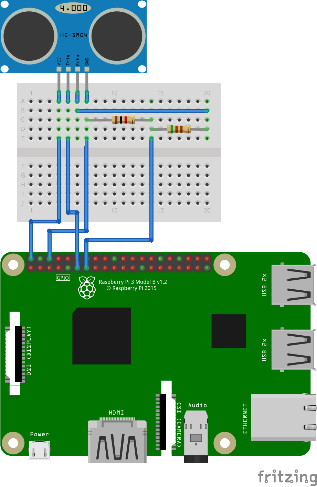
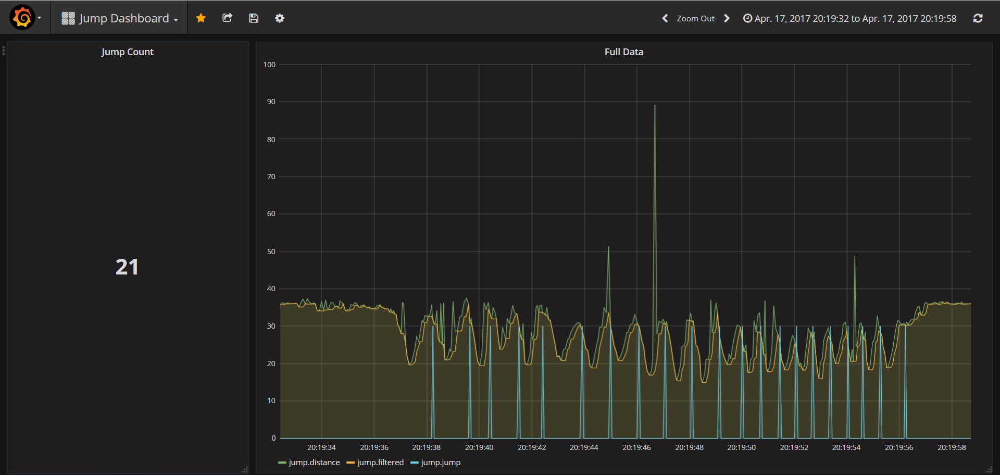
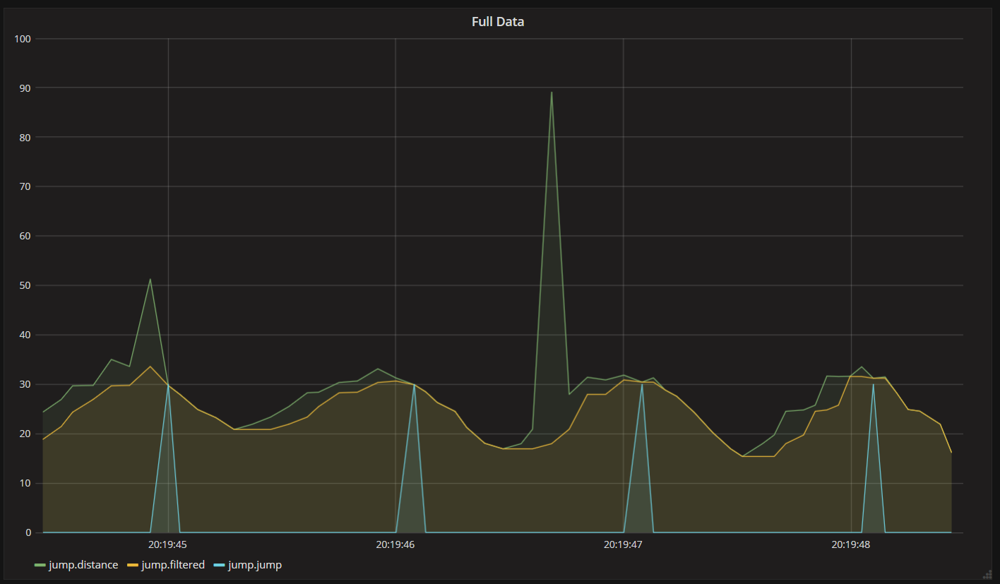
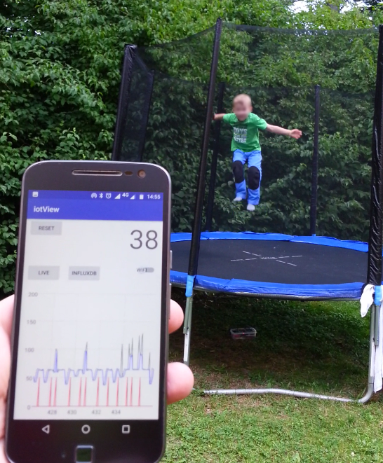

# Range-Things
RaspberryPI3 + Android Things with 
Nearby Connections, Bluetooth Low Energy and a HCSR04 Ultrasonic Distance Sensor 

## Pi3 + Sensor schematics:

The app should query the sensor as fast to detect changes in the measured distance.

The idea was to place the PI and the sensor below a trampoline and count all jumps.
There is a very simple "gliding lowest" filter. that will always take the shortest 
distance of the last 3 samples. 

Here is the screenshot of the collected demo data. 

## Time series data:

## Zoom into demo data:

## Real life application:

The filter and jump detection is done on the RaspberryPI3. 
For debugging purpose I transmit not only the detected jump events, but also the 
raw range sensor data and the filtered range data to the phone.

The filter was necessary because when the system is performing system tasks, 
it will handle the i/o port interrupt too late and report a longer distance than actually detected. 
You can see these spikes in the raw sensor data. 

